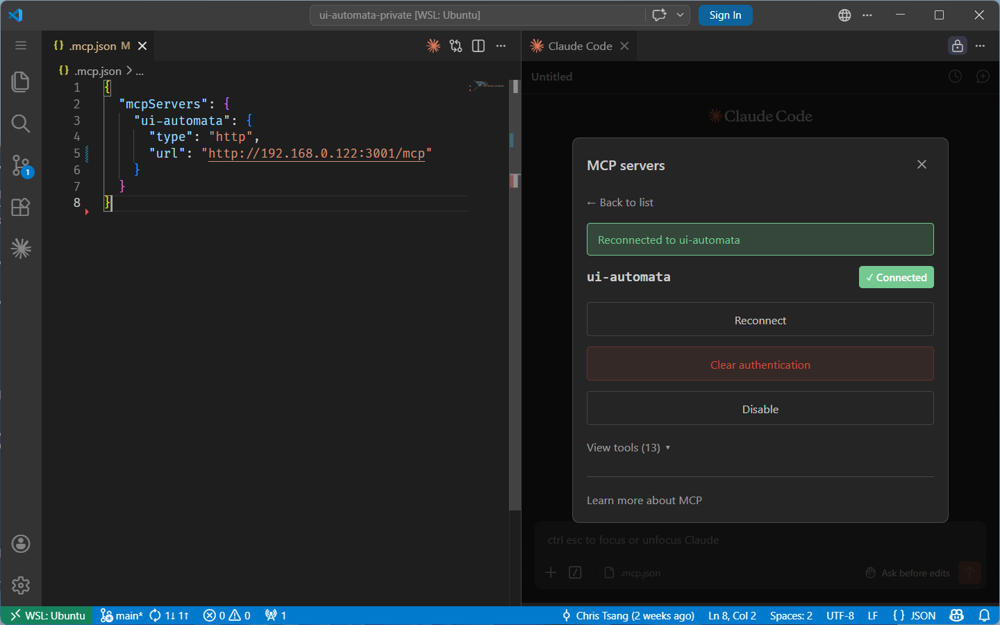
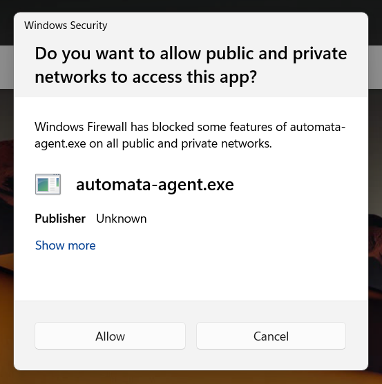
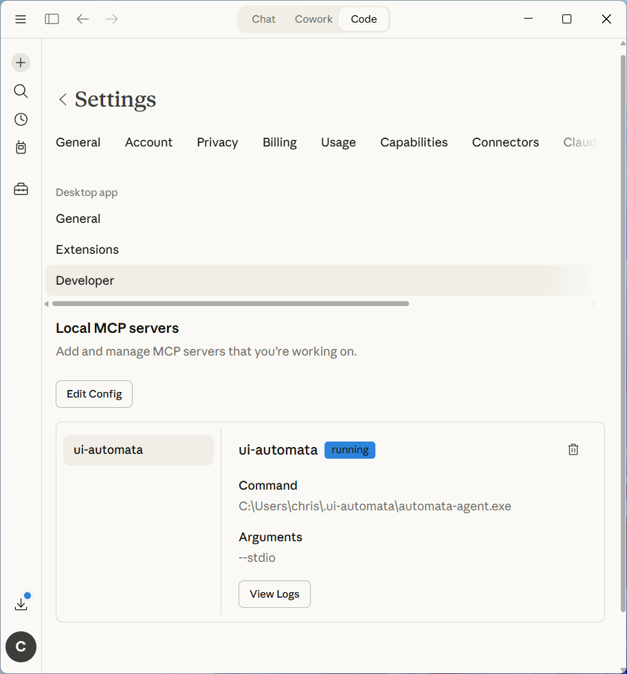

# Connecting MCP

`automata-agent` is an MCP server that exposes all `ui-automata` tools to Claude. It ships with the installer and supports two connection modes depending on which Claude client you use.

## Claude Code

Launch `automata-agent` by double-clicking it in `C:\Users\<you>\.ui-automata\`, or from PowerShell:

```powershell
automata-agent
```

The agent scans ports 3001–4000 for a free one, then prints the complete ready-to-paste MCP config to the terminal:

```go
automata-agent started
host : 127.0.0.1
port : 3001

MCP config (paste into .mcp.json, keep this window open):
{
  "mcpServers": {
    "ui-automata": {
      "type": "http",
      "url": "http://127.0.0.1:3001/mcp"
    }
  }
}
```

Copy the config block from the terminal (not from this page — the port may differ) and paste it into your `.mcp.json`. Keep the terminal window open while you work.

After updating `.mcp.json`, run `/mcp` in Claude Code and click **Reconnect** next to the ui-automata server. If the tools still don't appear, run **Developer: Reload Window** from the VS Code command palette (`Ctrl+Shift+P`) and reconnect again.



### Inside WSL

WSL cannot reach `127.0.0.1` on the Windows host — that loopback address is local to Windows only. You need to bind `automata-agent` to the Windows host's LAN IP and allow it through the Windows Firewall.

**Step 1 — find the Windows host IP**

In PowerShell, run `ipconfig` and look for the IPv4 address of your main network adapter (typically "Ethernet adapter" or "Wi-Fi"):

```powershell
ipconfig
```

```
Ethernet adapter Ethernet:
   IPv4 Address. . . . . . . . . . . : 192.168.0.120
```

**Step 2 — bind `automata-agent` to that IP**

Pass the address via `--host`:

```powershell
automata-agent --host 192.168.0.120
```

The agent will print an MCP config block using that IP instead of `127.0.0.1`.

**Step 3 — allow the port through Windows Firewall**

Windows Firewall blocks inbound connections to the port by default. Add an inbound rule to allow it:



Or add the rule from PowerShell (replace `3001` with the port printed by the agent):

```powershell
New-NetFirewallRule -DisplayName "automata-agent" -Direction Inbound -Protocol TCP -LocalPort 3001 -Action Allow
```

**Step 4 — paste the config into WSL**

Copy the printed config block and paste it into `.mcp.json` inside your WSL home directory. The URL will use the Windows host IP:

```json
{
  "mcpServers": {
    "ui-automata": {
      "type": "http",
      "url": "http://192.168.0.120:3001/mcp"
    }
  }
}
```

:::caution
The Windows host IP can change (e.g. after a router restart or network switch). If the connection stops working, re-run `ipconfig`, restart `automata-agent --host <new-ip>`, update the firewall rule port if it changed, and update `.mcp.json`.
:::

## Claude Desktop

Claude Desktop uses stdio instead of HTTP. Add the following to your `claude_desktop_config.json`, replacing `<you>` with your Windows username:

```json
{
  "mcpServers": {
    "ui-automata": {
      "command": "C:\\Users\\<you>\\.ui-automata\\automata-agent.exe",
      "args": ["--stdio"]
    }
  }
}
```

Claude Desktop launches `automata-agent` automatically — you do not need to start it manually.

:::caution After editing the config

Claude Desktop must be **fully quit** before it will pick up the new config. Closing the window is not enough — Claude minimises to the taskbar. Right-click the Claude icon in the system tray and choose **Quit**, then relaunch it.

:::

You should be able to find `ui-automata` listed under **Settings → Connectors** in Claude Desktop.



## Verify

Then ask: *"list the ui-automata tools available to you"*. It should respond with the full tool list. If it does, the connection is working.

## Which Model to Use

**Sonnet 4.6** is fast enough for interactive use: exploring a UI, running one-off actions, checking workflow status.

**Opus 4.6** reasons better about complex workflows and is the right choice when authoring multi-phase automations or debugging unexpected behaviour.

## Context Initialization

:::tip Before doing anything else

Ask Claude to read `CLAUDE.md` and the relevant workflows from the library before starting a task. This gives it the context it needs to work effectively without you having to explain the project each time.

In **Claude Code** (HTTP mode), the workflow library is exposed as MCP resources — Claude can browse and fetch them directly:

> *"Read the CLAUDE.md and AGENT.md from the ui-automata resource list before we start."*

In **Claude Desktop** (stdio mode), use the built-in resources tool to fetch them:

> *"Use the resources tool to read CLAUDE.md and AGENT.md from ui-automata before we start."*

Either way, a Claude that has read the library writes better workflows faster and makes fewer avoidable mistakes.

:::
